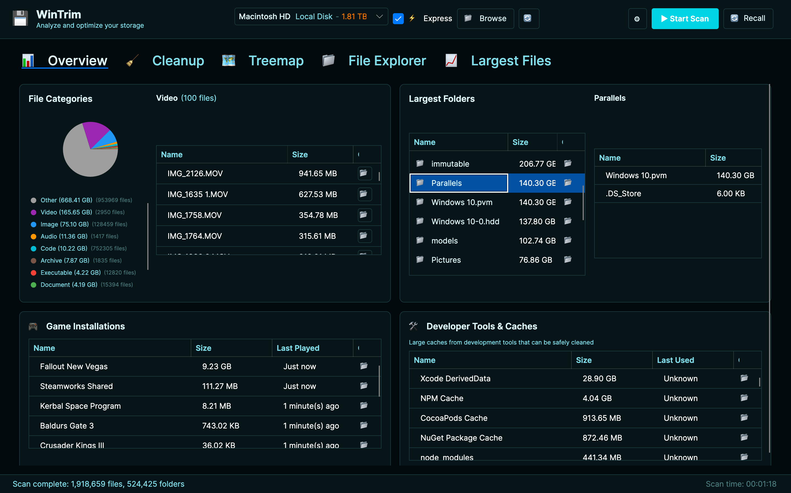
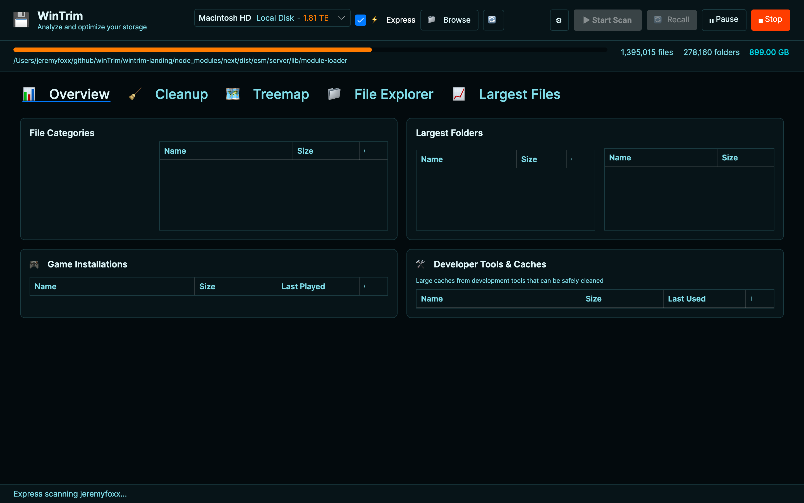
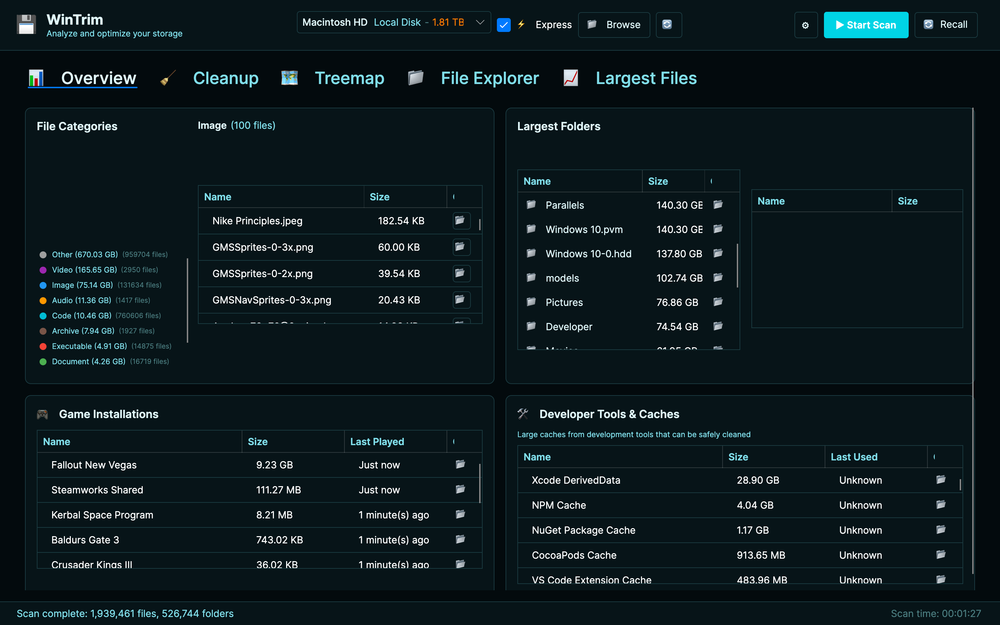
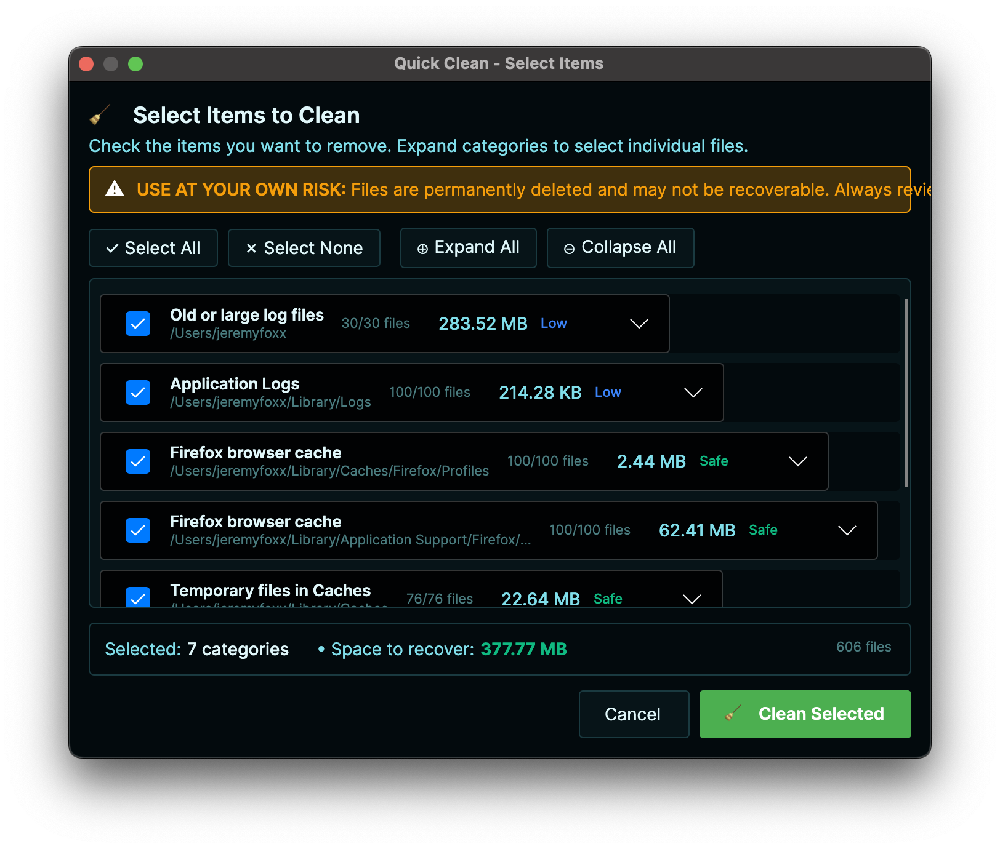
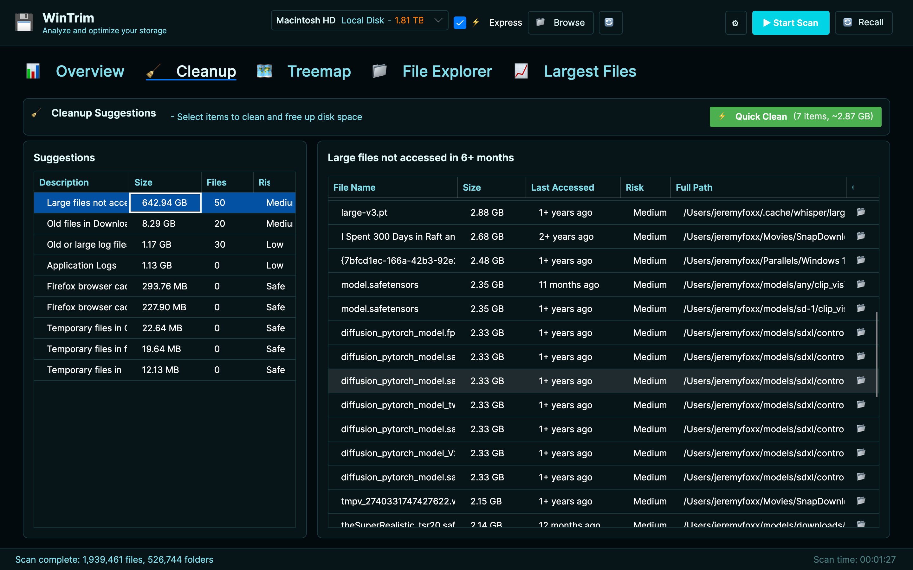

# WinTrim - Cross-Platform Disk Analyzer

A fast, safe, and powerful disk analyzer to visualize storage, find duplicates, detect developer caches, and clean up disk space. Available on **Windows**, **macOS**, and **Linux**.




## Platform Support

| Platform | Status | Notes |
| --- | --- | --- |
| **Windows 10/11** | Fully Supported | Native x64 builds |
| **macOS** | Fully Supported | Apple Silicon (M1/M2/M3/M4) & Intel |
| **Linux** | Fully Supported | x64, tested on Ubuntu/Debian |

## Features

### Disk Scanning & Analysis

- **Fast recursive scanning** with async parallel processing and work-stealing
- **Storage analytics** — visual breakdown by category (Documents, Media, Games, etc.)
- **Largest files finder** — top 50 largest files with quick access
- **File age analysis** — identify files not accessed in 90+ days
- **Session persistence** — automatically saves and restores your last scan

### Interactive Visualization

- **Treemap view** — SkiaSharp-based squarified treemap with drill-down navigation
- **5 treemap color schemes** — Vivid, Pastel, Ocean, Warm, and Cool
- **Pie charts** — category breakdown
- **Bar charts** — largest folders at a glance
- **Tree view** — hierarchical folder navigation with search & filters

### Cleanup & Disk Management

- **Quick Clean** — one-click cleanup with preview and file-level selection
- **Cleanup recommendations** — risk-rated suggestions (Safe / Low / Medium / High)
- **Duplicate file finder** — xxHash64-based detection with bulk delete
- **Time Machine analysis** — backup insights and exclusion suggestions (macOS)

### Developer Tools Detection

- **npm** — node_modules, npm cache
- **NuGet** — package cache
- **pip** — Python package cache
- **Maven** — .m2 repository
- **Cargo** — Rust package cache
- **Gradle** — Android/Java build cache
- **Docker** — images and build cache

### Game Detection

- **Steam**, **Epic Games**, **GOG**, and **Xbox** game installations auto-detected with size breakdowns

### Export

- **CSV** and **JSON** export of scan results

### UI/UX

- **5 themes** — Default (Retrofuturistic), Tech (Blade Runner), Enterprise (Light), Terminal Green, Terminal Red
- **Settings panel** — font size, treemap colors, treemap depth controls
- **4 font size presets** — Small, Medium, Large, Extra Large
- **Scan controls** — Start / Stop / Pause with progress tracking
- **Sortable data grids** — click headers to sort by name, size, date
- **Context menus** — right-click to open location or copy path
- **File explorer filters** — search and filter by type, size, age

## Screenshots

| Dashboard & Treemap | Quick Clean |
| --- | --- |
|  |  |

| Detail View | Settings |
| --- | --- |
|  |  |

## Getting Started

### Prerequisites

- [.NET 8.0 SDK](https://dotnet.microsoft.com/download/dotnet/8.0) or later

### Download

Visit the [Releases](https://github.com/mobius29er/winTrim/releases) page and download for your platform.

### Build from Source

```bash
git clone https://github.com/mobius29er/winTrim.git
cd winTrim/WinTrim.Avalonia
dotnet restore
dotnet build
dotnet run
```

### Build Standalone Executables

```bash
# Windows
dotnet publish -c Release -r win-x64 --self-contained true

# macOS (Apple Silicon)
dotnet publish -c Release -r osx-arm64 --self-contained true

# macOS (Intel)
dotnet publish -c Release -r osx-x64 --self-contained true

# Linux
dotnet publish -c Release -r linux-x64 --self-contained true
```

## Project Structure

```
WinTrim.Avalonia/           # Cross-platform UI (Avalonia)
├── Views/                  # AXAML UI files
├── ViewModels/             # MVVM ViewModels
├── Controls/               # Custom controls (TreemapControl)
├── Services/               # Theme service
├── Converters/             # Value converters
└── Themes/                 # 5 color themes

WinTrim.Core/               # Shared business logic
├── Models/                 # Data models
└── Services/               # Core services
    ├── FileScanner          # Parallel scanning engine
    ├── DuplicateScanner     # xxHash64 duplicate detection
    ├── GameDetector         # Steam/Epic/GOG/Xbox detection
    ├── DevToolDetector      # Developer cache detection
    ├── CleanupAdvisor       # Risk-rated cleanup recommendations
    ├── CleanupService       # Execute cleanup operations
    ├── ExportService        # CSV/JSON export
    ├── SettingsService      # User preferences & scan caching
    ├── TimeMachineAnalyzer  # macOS Time Machine analysis
    ├── TreemapLayoutService # Squarified treemap algorithm
    └── CategoryClassifier   # File type classification

wintrim-landing/            # Next.js landing page
DiskAnalyzer/               # Legacy WPF version (Windows only)
```

## Technical Details

- **Framework:** .NET 8.0 + Avalonia UI 11.2
- **Architecture:** MVVM with CommunityToolkit.Mvvm
- **Charts:** LiveCharts2 (SkiaSharp)
- **Treemap:** Custom SkiaSharp-based squarified treemap with iterative layout
- **Hashing:** xxHash64 for duplicate file detection
- **Async:** Full async/await with CancellationToken support
- **Persistence:** JSON-based settings and scan caching
- **Performance:** Parallel breadth-first scan with work-stealing, iterative algorithms to prevent stack overflow

## Safety

- **Read-only scanning** — no files are modified during analysis
- **Preview before delete** — Quick Clean shows exactly what will be removed
- **Risk levels** — every cleanup suggestion rated Safe / Low / Medium / High
- **Graceful error handling** — inaccessible folders are skipped, not crashed on
- **Memory efficient** — processes files in batches

## Themes

| Theme | Description |
| --- | --- |
| **Default** | Retrofuturistic teal/cyan with orange accents |
| **Tech** | Cyberpunk neon — cyan/pink on void black |
| **Enterprise** | Professional Windows-style — clean blues and grays (light mode) |
| **Terminal Green** | Classic terminal — green on black |
| **Terminal Red** | Alert terminal — red on black |

## Roadmap

See [docs/roadmap-v2.md](docs/roadmap-v2.md) for the full v2.0 development plan targeting DaisyDisk parity with performance optimizations, progressive rendering, Quick Look preview, cloud storage detection, APFS snapshot management, localization, and more.

## Disclaimer

**USE AT YOUR OWN RISK**

WinTrim is a disk cleanup utility that **permanently deletes files**. Please be aware:

- **Deleted files may not be recoverable** — files are permanently deleted, not sent to the Recycle Bin
- **Always backup important data** before using cleanup features
- **Review items before deletion** — use the preview feature to see exactly what will be removed
- **Check risk levels** — each cleanup suggestion shows Safe / Low / Medium / High risk indicators

This software is provided "AS IS" without warranty of any kind. Foxxception LLC shall not be liable for any data loss or damages arising from the use of this software.

## License

MIT License - see [LICENSE](LICENSE) for details.

Copyright (c) 2026 Foxxception LLC
